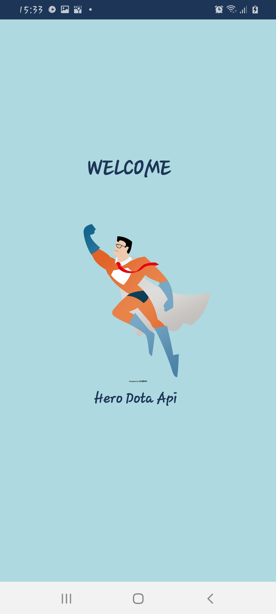
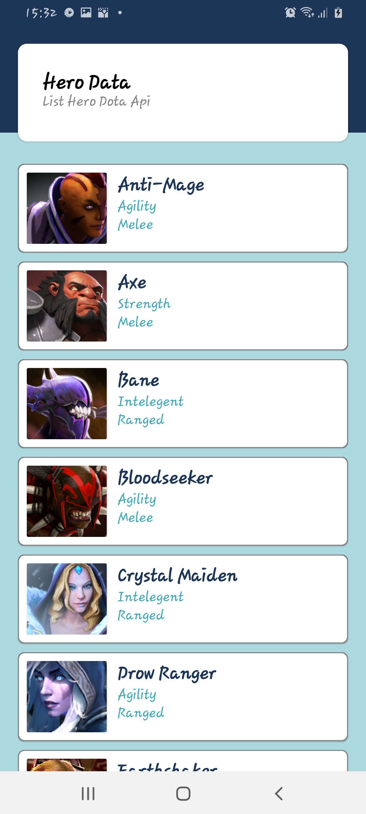

# Dota-Rest-Api
## Tampilan Aplikasi
||||
|---|---|---|
## Volley
> Volley Library merupakan merupakan produk yang diperkenalkan oleh Google untuk
mempermudah pertukaran data tanpa harus membuat deretan kode yang sangat panjang. Secara
default volley menggunakan metode singkronisasi.
Fitur yang ditawarkan Volley library adalah sebagai berikut:
1. Melakukan sebuah request queuing and prioritization (Mengutamakan prioritas dalam sebuah antrian).
2. Sangat efektif untuk melakukan chace dan efesiensi penyimpanan (memory).
3. Dapat melakukan perubahan class sesuai dengan kebutuhan.
4. Dapat melakukan pembatalan dalam sebuah request.
Dari beberapa fitur diatas, ada kata yang menjadi point yaitu “request” Jadi Volley ini
sangat baik digunakan untuk melakukan permintaan data ke server melalui web service dengan
memperhatikan antrian dalam permintaan data data skala prioritas.
Library Volley inti dikembangkan di GitHub dan berisi pipeline pengiriman permintaan
utama serta seperangkat utilitas yang berlaku secara umum, dan tersedia di "toolbox" Volley.
## Manfaat Volley Library
* Penjadwalan otomatis permintaan jaringan.
* Beberapa koneksi jaringan serentak.
* Caching respons disk dan memori transparan dengan koherensi cache HTTP standar.
* Dukungan untuk pemrioritasan permintaan.
* API permintaan pembatalan. Anda bisa membatalkan satu permintaan, atau menetapkan blok atau cakupan permintaan untuk dibatalkan.
* Kemudahan kustomisasi, misalnya, untuk mencoba ulang dan backoff.
* Pemesanan kuat yang memudahkan pengisian UI Anda dengan benar menggunakan data yang diambil secara asinkron dari jaringan.
* Fitur proses debug dan penelusuran.
## Kelebihan Volley Library
- [x] Automatic scheduling of network requests.
- [x] Beberapa koneksi jaringan bersamaan.
- [x] Manajemen caching
- [x] Support prioritas Request.
- [x] Cancel Request API.
- [x] Mudah dicustom.
- [x] Debugging dan tracing tools.

Berikut adalah Class penting dalam libray ini :
* RequestQueue: Antrian yang berisi Request Network / HTTP yang perlu dibuat.
* Request: Class dasar yang berisi informasi terkait jaringan seperti Metode HTTP.
* StringRequest: HTTP Request dengan respon String.
* JsonObjectRequest: Permintaan HTTP dengan respon JSONObject.
## Perbandingan Volley dengan Retrofit
|**Perbandingan**|Volley|Retrofit|
|---|---|---|
|Mudah Digunakan|Sedikit lebih rumit pada umumnya. Volley hanya mendukung beberapa response yaitu String,Image,JSONObject dan JSONArray.|Retrofit sangat mudah digunakan. Memungkinkan anda untuk memakai API ini dengan method sederhana dari java menggunakan interface.|
|Performan dan Caching|Volley memiliki mekasnisme chacing yang lebih rumit dan fleksibel, memanfaatkan untuk membuat caching bitmaps yang lebih besar.|Caching harusnya bisa berjalan jika server anda menetapkan header control yang benar. Jika tidak ,atau anda melakukan sesuatu yang tidak biasa anda hanya bisa mengubah lapisan klien Http anda.|
|POST requests + multipart uploads|Support POST request tetapi anda harus convert terlebih dahulu java objek yang kita buat menjadi JSONObject.|Memiliki dukungan penuh untuk permintaan POST dan upload file yang multi, dengan API Sweet untuk boot.|
|Penggunaan|Library buatan Google ini kurang populer dibandingkan dua library lainnya, karena sedikit fitur yang dimilikinya.  Secara default, Volley menggunakan metode sinkronisasi.  Jadi, anda tidak perlu membuat method atau fungsi yang menggunakan class Asynctask.  Dalam penggunaannya memang 'sedikit' sulit.  Volley tidak cocok untuk operasi download  atau streaming yang besar karena Volley menyimpan semua respons dalam memori saat mengambil API data.|Library turunan dari OKHTTP yang dibuat oleh Square yang digunakan sebagai REST Client pada Android, yang pasti akan memudahkan kita.  Karena kita tidak perlu lagi membuat method sendiri untuk menggunakan REST Client API dari Backend.  Library ini menyediakan framework yang powerfull untuk aunthenticating dan berinteraksi dengan API dengan mengirimkan request menggunakan OKHTTP.  Library Retrofit juga banyak digunakan oleh perusahaan startup dalam aplikasi Mobile mereka, salah satunya adalah Tokopedia dan OVO.  Tidak hanya itu, aplikasi media sosial yang kita gunakan setiap hari juga menggunakan Library Retrofit.
## JSON
> JSON (JavaScript Object Notation) adalah format pertukaran data yang ringan, mudah
dibaca dan ditulis oleh manusia, serta mudah diterjemahkan dan dibuat (generate) oleh komputer.
Format ini dibuat berdasarkan bagian dari Bahasa Pemprograman JavaScript. JSON merupakan
format teks yang tidak bergantung pada bahasa pemprograman apapun karena menggunakan
gaya bahasa yang umum digunakan oleh programmer keluarga C termasuk C, C++, C#, Java,
JavaScript, Perl, Python dll. Oleh karena sifat-sifat tersebut, menjadikan JSON ideal sebagai
bahasa pertukaran-data.

JSON terbuat dari dua struktur:
1. Kumpulan pasangan nama/nilai. Pada beberapa bahasa, hal ini dinyatakan sebagai objek
(object), rekaman (record), struktur (struct), kamus (dictionary), tabel hash (hash table),
daftar berkunci (keyed list), atau associative array.
2. Daftar nilai terurutkan (an ordered list of values). Pada kebanyakan bahasa, hal ini
dinyatakan sebagai larik (array), vektor (vector), daftar (list), atau urutan (sequence).
Struktur-struktur data JSON disebut sebagai struktur data universal. Pada dasarnya,
semua bahasa pemprograman modern mendukung struktur data JSON dalam bentuk yang sama
maupun berlainan.

